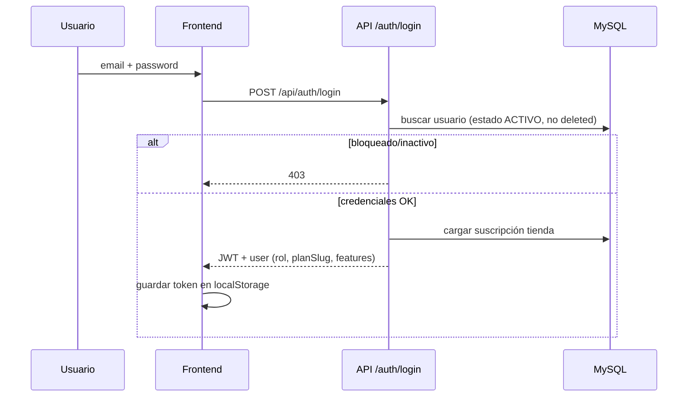
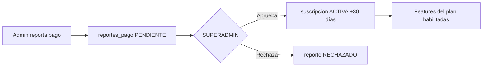

# Flujo del sistema y roles — lilit POS

## Arquitectura general

```
┌─────────────────┐     HTTPS/JSON      ┌──────────────────────┐
│  React (Vite)   │ ◄──────────────────► │  Express API :5000   │
│  :5173          │     JWT Bearer       │  MVC + MySQL         │
└─────────────────┘                      └──────────┬───────────┘
                                                    │
                                         ┌──────────▼───────────┐
                                         │  MySQL (lilit_db)    │
                                         └──────────────────────┘
```

- **Frontend:** SPA React con rutas protegidas por rol y plan.
- **Backend:** Express 5, JWT, bcrypt, MySQL2.
- **Multi-tenant:** cada tienda (`tienda_id`) aísla datos de inventario, ventas, cuentas, etc.

---

## Roles del sistema

| Rol | Código BD | Alcance |
|-----|-----------|---------|
| **SUPERADMIN** | `SUPERADMIN` | Plataforma SaaS: comercios, suscripciones, pagos, **usuarios globales** |
| **ADMIN** | `ADMIN` | Su tienda: dashboard, inventario, cuentas, planes, reportes según plan |
| **CAJERO** | `CAJERO` | POS, apertura/cierre de caja, ventas |

### Matriz de acceso (frontend)

| Módulo | SUPERADMIN | ADMIN | CAJERO |
|--------|:----------:|:-----:|:------:|
| Dashboard | ✅ | ✅* | ❌ |
| POS Ventas | ✅ | ✅ | ✅ |
| Inventario | ✅ | ✅* | ❌ |
| Cuentas por pagar | ✅ | ✅* | ❌ |
| Planes / suscripción | ✅ | ✅ | ❌ |
| Panel Admin SaaS | ✅ | ❌ | ❌ |
| Gestión usuarios | ✅ | ❌ | ❌ |

\* Requiere feature del plan activo (`dashboard`, `inventario`, `cuentas`, etc.)

---

## Flujo de autenticación



**JWT incluye:** `id`, `tiendaId`, `email`, `role`, `planSlug`, `features[]`, `subscriptionActive`.

**Middleware backend:**
- `verifyToken` — valida Bearer JWT
- `checkRole(['ADMIN'])` — SUPERADMIN bypass
- `checkFeature('cuentas')` — valida feature del plan

---

## Flujo por rol — SUPERADMIN

1. Login con `dueno@lilit.ve`
2. Accede a `/admin` (Control SaaS)
3. **Comercios:** ver tiendas, cambiar plan, suspender/activar suscripción
4. **Usuarios:** crear, editar, activar, inactivar, bloquear, eliminar (soft), restaurar
5. **Pagos:** aprobar/rechazar reportes de pago de clientes

No depende del plan de tienda — siempre tiene features Pro completas.

---

## Flujo por rol — ADMIN (dueño/gerente)

1. Login → JWT con features según plan de su tienda
2. Si suscripción **SUSPENDIDA/CANCELADA:** solo puede ver `/planes`
3. Flujo típico:
   - Abrir **caja** (conteo billetes USD/Bs)
   - Operar **POS** o delegar a cajeros
   - Revisar **dashboard** e **inventario**
   - Gestionar **cuentas por pagar** (plan Estándar+)
   - Reportar pago de suscripción en **Planes**

---

## Flujo por rol — CAJERO

1. Login → plan de la tienda limita features
2. Solo **POS** (`/pos`) sin restricción de feature
3. Puede abrir/cerrar caja si la UI lo permite
4. No ve dashboard, inventario, cuentas ni admin

---

## Flujo de suscripción (SaaS)



**Planes:**

| Plan | Precio | Usuarios | Features clave |
|------|--------|----------|----------------|
| Económico | $15 | 1 | POS, inventario, BCV, caja |
| Estándar | $18 | 3 | + cuentas, gastos, clientes |
| Pro | $22 | ∞ | + estadísticas, multi-sucursal |

---

## Flujo de venta (POS)

1. Verificar caja **ABIERTA**
2. `POST /api/ventas/crear` con items, método pago, tasa BCV
3. Descuenta stock de productos
4. Registra en `ventas` + `items_venta`

---

## Flujo olvido de contraseña

1. `POST /api/auth/forgot-password` — siempre respuesta genérica (seguridad)
2. Genera token SHA-256 en `password_reset_tokens` (1 h)
3. Email vía Nodemailer (o log en consola en dev)
4. `POST /api/auth/reset-password` — nueva contraseña

---

## Estados de usuario (nuevo)

| Estado | Login | Uso |
|--------|-------|-----|
| ACTIVO | ✅ | Normal |
| INACTIVO | ❌ | Vacaciones, baja temporal |
| BLOQUEADO | ❌ | Abuso, impago interno |
| deleted_at | ❌ | Eliminación lógica |

Campo `activo` (legacy) se sincroniza: ACTIVO→1, resto→0.

---

## Soft delete en entidades

Tablas con `deleted_at`:
- `tiendas`, `usuarios`, `productos`, `clientes`, `proveedores`
- `categorias_producto`, `suscripciones`, `reportes_pago`, `cuentas_pagar`

**Regla:** las consultas de negocio filtran `deleted_at IS NULL`.

---

## Endpoints API por área

Ver `src/routes/apiRoutes.js`. Resumen:

| Área | Prefijo | Auth |
|------|---------|------|
| Auth | `/auth/*` | Público (login, reset) |
| Caja | `/caja/*` | Token |
| Ventas | `/ventas/*` | Token |
| Productos | `/productos` | Token (+ rol admin crear) |
| Cuentas | `/cuentas/*` | Token + feature |
| Admin SaaS | `/admin/*` | Token + SUPERADMIN |
| Suscripciones | `/suscripciones/*` | Token |

---

## Archivos clave

| Capa | Archivo |
|------|---------|
| Rutas | `src/routes/apiRoutes.js` |
| Auth | `src/controllers/AuthController.js` |
| Usuarios admin | `src/controllers/UserController.js` |
| Middleware | `src/middlewares/authMiddleware.js` |
| Plan features | `src/config/planFeatures.js` |
| Frontend auth | `src/context/AuthContext.jsx` |
| Rutas UI | `src/App.jsx` |
| Panel admin | `src/pages/AdminPanel.jsx` |
